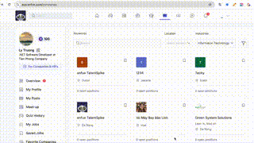

# 🏢 Enfue Companies Search Platform

[](https://www.docker.com/)
[](https://typesense.org/)
[](https://python.org/)
[](LICENSE)

Professional search platform built with Typesense for company discovery and job opportunities across Vietnam.

## 🚀 Quick Start

```bash
git clone https://github.com/lytv/enfue.git
cd enfue
./docker-deploy.sh
```

## 🌐 Live Demo

### 🚀 Production (Render)
- **Main Demo**: [https://enfue-1.onrender.com/index.html](https://enfue-1.onrender.com/index.html)
- **Advanced Search**: [https://enfue-1.onrender.com/advanced-search.html](https://enfue-1.onrender.com/advanced-search.html)
- **Semantic Search**: [https://enfue-1.onrender.com/semantic-search.html](https://enfue-1.onrender.com/semantic-search.html)

### 🏠 Local Development
- **Main Demo**: http://localhost:8080/index.html
- **Advanced Search**: http://localhost:8080/advanced-search.html
- **Semantic Search**: http://localhost:8080/semantic-search.html
- **Typesense API**: http://localhost:8108

## 🎬 Demo Video

### 🎥 Live Demo Preview


### 📹 Download Full Video
- **MP4 (Recommended)**: [demo.mp4](demo.mp4) (7.3MB)
- **MOV (Original)**: [demo.mov](demo.mov) (26.4MB)
- **GIF (Preview)**: [demo.gif](demo.gif) (521KB)

**Demo Features:**
- Natural language search queries
- Advanced filtering and faceted search
- Semantic search capabilities
- Real-time search results

## 🔍 Search Features

### 1. **Natural Language Search**
- Ask questions in plain English
- "hiring companies" → Companies with open positions
- "tech companies in Da Nang" → Tech companies in Da Nang
- "companies with more than 5 positions" → Companies hiring heavily

### 2. **Advanced Search**
- Faceted search with interactive filters
- Auto-complete suggestions
- Advanced filtering with numeric operators
- Pagination and highlighting

### 3. **Semantic Search**
- Multi-field search across company names and locations
- Context understanding for relevant results
- Intelligent ranking and search analytics

## 📊 Data Overview

- **196 Companies** indexed from Vietnam job market
- **8 Major Cities**: Da Nang (161), Hue (21), Ho Chi Minh (7), Ha Noi (3), etc.
- **17 Companies** with open positions
- **~20 Total Positions** available

## 🛠️ Technical Stack

- **Search Engine**: Typesense 29.0
- **Backend**: Python 3.11 with HTTP server
- **Frontend**: Vanilla JavaScript with modern CSS
- **Deployment**: Docker containerization + Render cloud hosting
- **Data**: CSV import with automatic parsing
- **Cloud Hosting**: [Render](https://render.com) - Auto-deploy from GitHub

## 🔧 Management Commands

### 🏠 Local Development
```bash
./docker-deploy.sh                    # Deploy services locally
docker stop enfue-typesense enfue-web # Stop services
docker logs enfue-web                 # View logs
docker ps                            # Check status
curl http://localhost:8080/health    # Health check
docker system prune -f               # Clean up
```

### 🚀 Production (Render)
- **Auto-deploy**: Pushes to `main` branch automatically deploy
- **Manual deploy**: Use Render dashboard to trigger deployments
- **Logs**: Available in Render dashboard
- **Health check**: [https://enfue-1.onrender.com/health](https://enfue-1.onrender.com/health)

## 📁 Project Structure

```
enfue/
├── index.html                    # Main search interface
├── advanced-search.html         # Advanced search features
├── semantic-search.html         # Semantic search demo
├── docker-deploy.sh             # Docker deployment script (local)
├── Dockerfile                   # Docker configuration for Render
├── requirements.txt             # Python dependencies
├── render.yaml                  # Render service configuration
├── setup_typesense.py          # Data import script
├── serve_demo_docker.py        # HTTP server for Docker
└── Run_Browser_Agent_With_A_Goal_In_Background_2025-10-02T03_02_40.209Z.csv
```

## 📈 Performance

- **Search Latency**: <3ms average
- **Index Time**: ~2-3 seconds for 196 records
- **Memory Usage**: ~5-10MB
- **Concurrent Searches**: 100+ queries/second

## 🎯 Use Cases

1. **Job Portal**: Find companies with open positions
2. **Company Directory**: Browse companies by location
3. **Recruitment**: Filter candidates by location preferences
4. **Market Analysis**: Understand job market distribution

## 🔍 Search Examples

### Natural Language Queries
```bash
"hiring companies"                    # → Companies with open positions
"tech companies in Da Nang"          # → Tech companies in Da Nang
"companies with more than 5 positions" # → Companies hiring heavily
"biggest companies"                  # → Companies sorted by position count
```

### Advanced Queries
```bash
"tech AND da nang AND open positions" # → Complex filtering
"companies:>5 positions"             # → Numeric filtering
"sort by positions descending"       # → Custom sorting
```

## 🏗️ Architecture

```
┌─────────────────┐    ┌─────────────────┐
│   Web Frontend  │    │    Typesense     │
│   (Port 8080)   │◄──►│   (Port 8108)    │
│                 │    │                  │
│ - HTML/CSS/JS   │    │ - Search Engine  │
│ - HTTP Server   │    │ - Data Storage   │
│ - API Client    │    │ - Query Engine   │
└─────────────────┘    └─────────────────┘
```

## 🚨 Troubleshooting

### Common Issues

1. **Docker credentials error**
   ```
   docker: error getting credentials - err: exec: "docker-credential-desktop": executable file not found
   ```
   **Solution**: Use `./docker-deploy.sh`

2. **No search results**
   - Check Typesense server: `curl http://localhost:8108/health`
   - Verify data import: `python3 setup_typesense.py`

3. **Connection errors**
   - Ensure Docker is running
   - Check port availability: `lsof -ti:8080`

4. **Render deployment issues**
   - Check Render dashboard logs
   - Verify environment variables are set correctly
   - Ensure GitHub repository is connected

### Debug Commands
```bash
# Local development
docker ps
docker logs enfue-web
curl http://localhost:8080/health
curl -H "x-typesense-api-key: Hu52dwsas2AdxdE" "http://localhost:8108/collections/enfue_companies/documents/search?q=*&query_by=company_name&per_page=1"

# Production (Render)
curl https://enfue-1.onrender.com/health
```

## 🤝 Contributing

1. Fork the repository
2. Create your feature branch (`git checkout -b feature/AmazingFeature`)
3. Commit your changes (`git commit -m 'Add some AmazingFeature'`)
4. Push to the branch (`git push origin feature/AmazingFeature`)
5. Open a Pull Request

## 📞 Support

For issues and questions:
1. Check service logs and health status
2. Review browser console for errors
3. Test API endpoints directly
4. Refer to [Typesense Documentation](https://typesense.org/docs/)

## 📄 License

This project is licensed under the MIT License - see the [LICENSE](LICENSE) file for details.

## 🙏 Acknowledgments

- [Typesense](https://typesense.org/) for the amazing search engine
- Vietnam tech community for inspiration
- All contributors and users

---

**Built with ❤️ for the Vietnam tech community**

**Happy Searching! 🔍✨**

[](https://github.com/lytv/enfue)
[](https://github.com/lytv/enfue)
